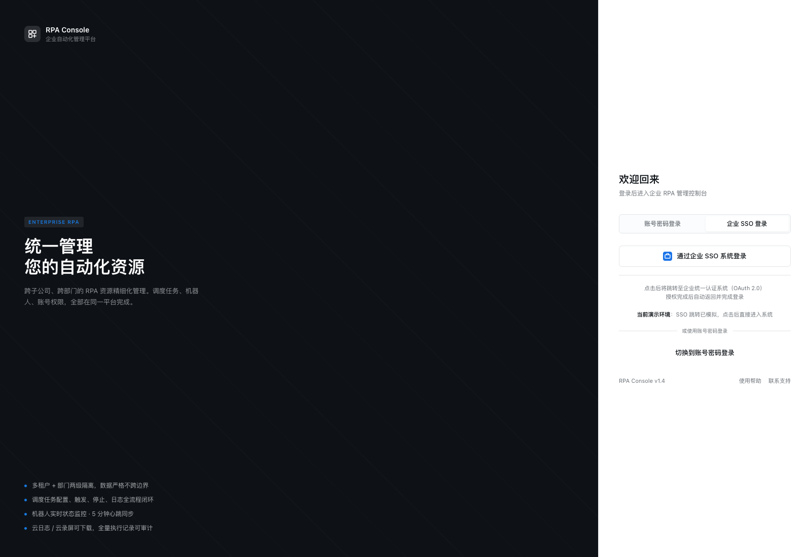
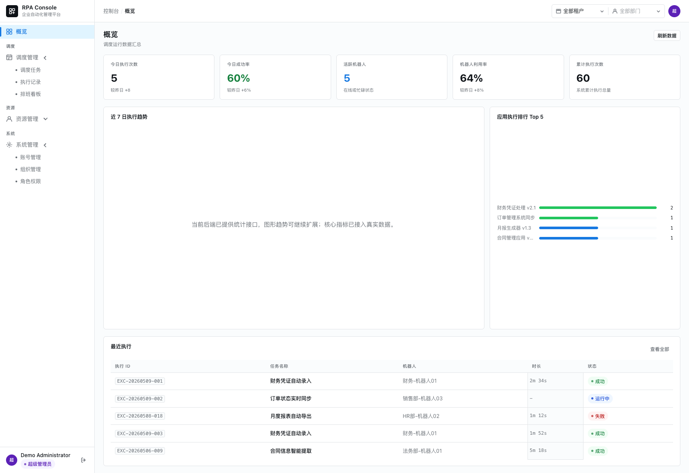
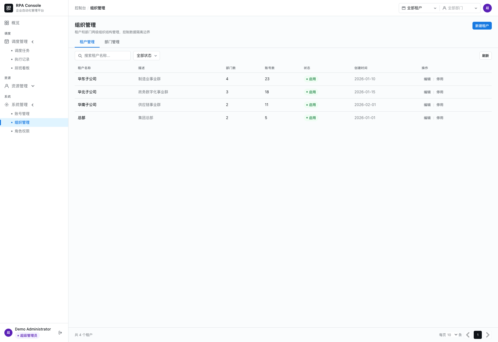
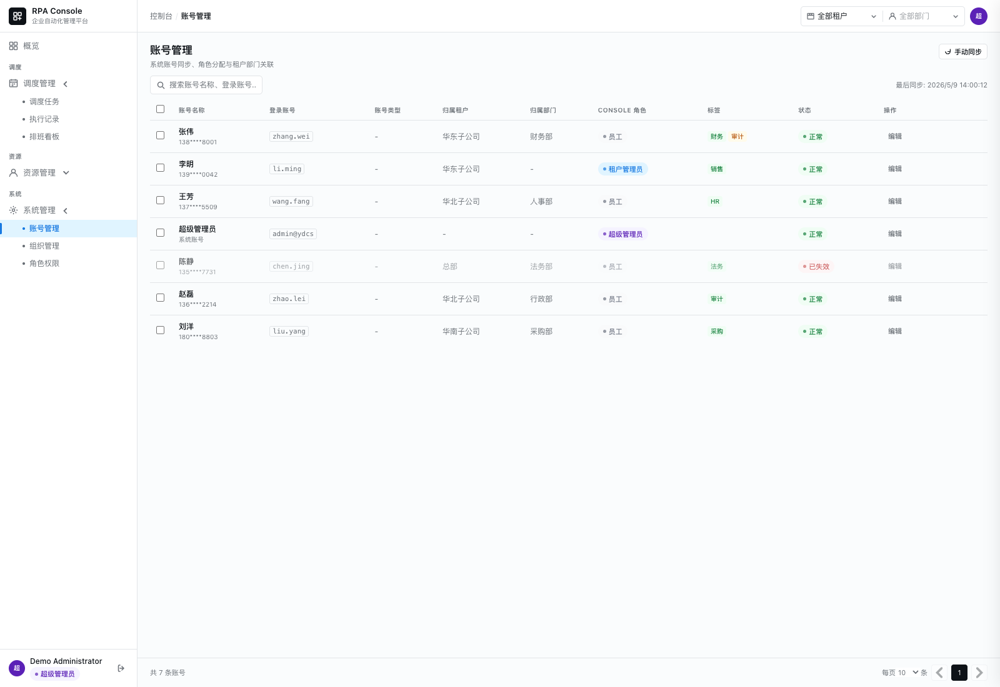
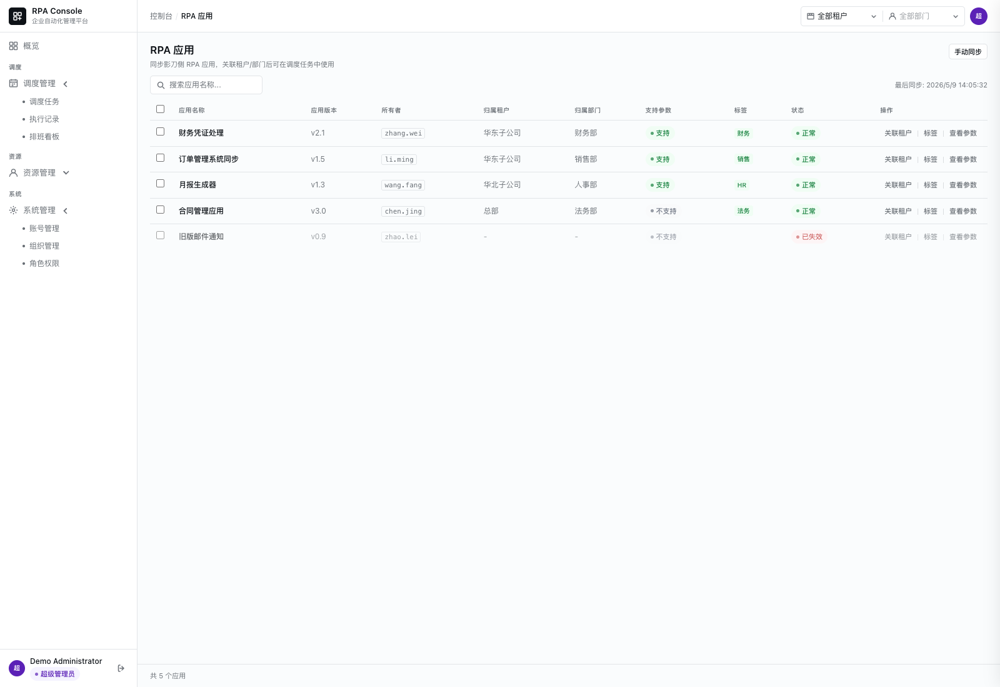
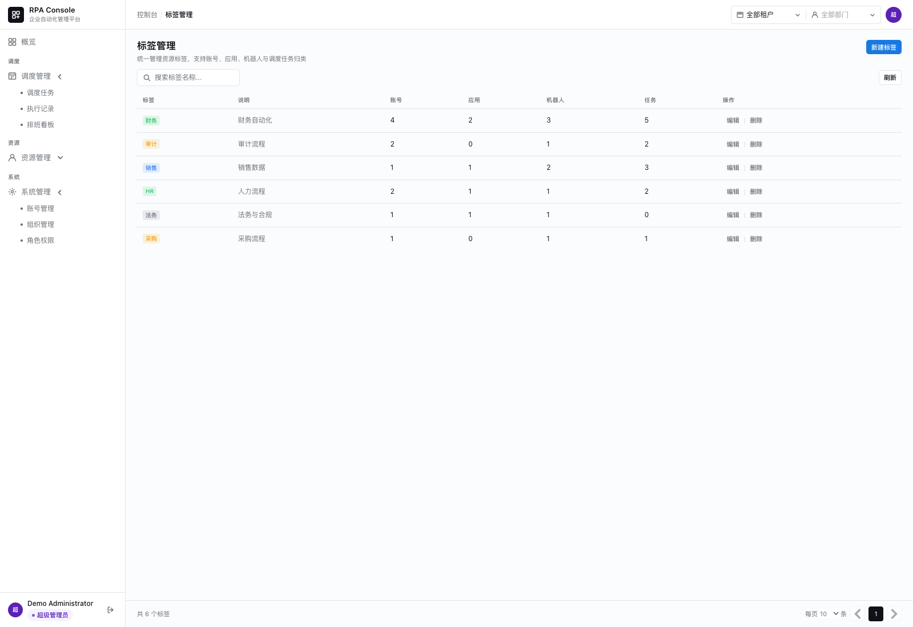
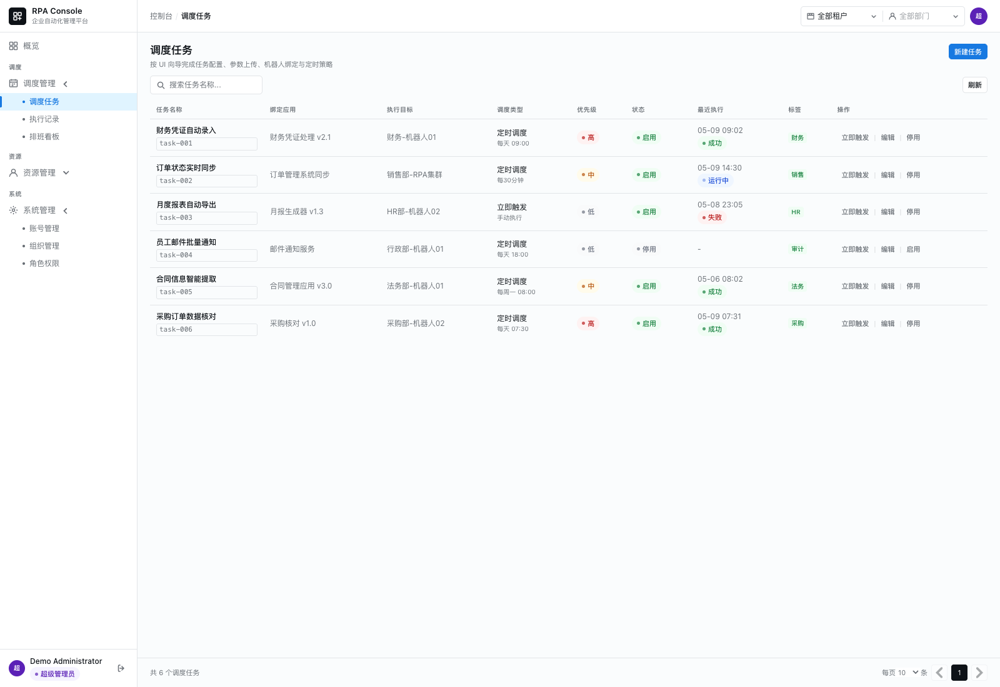
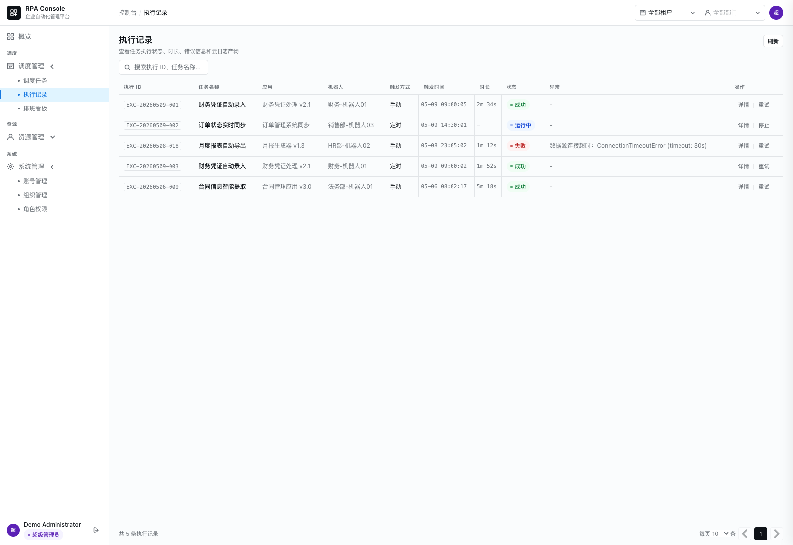
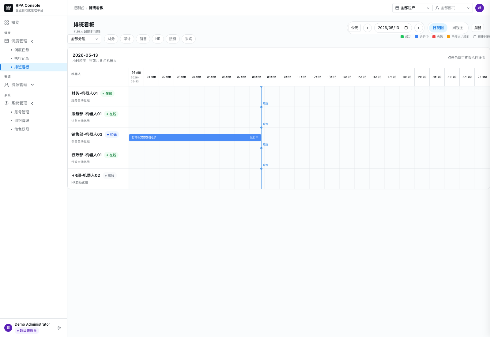
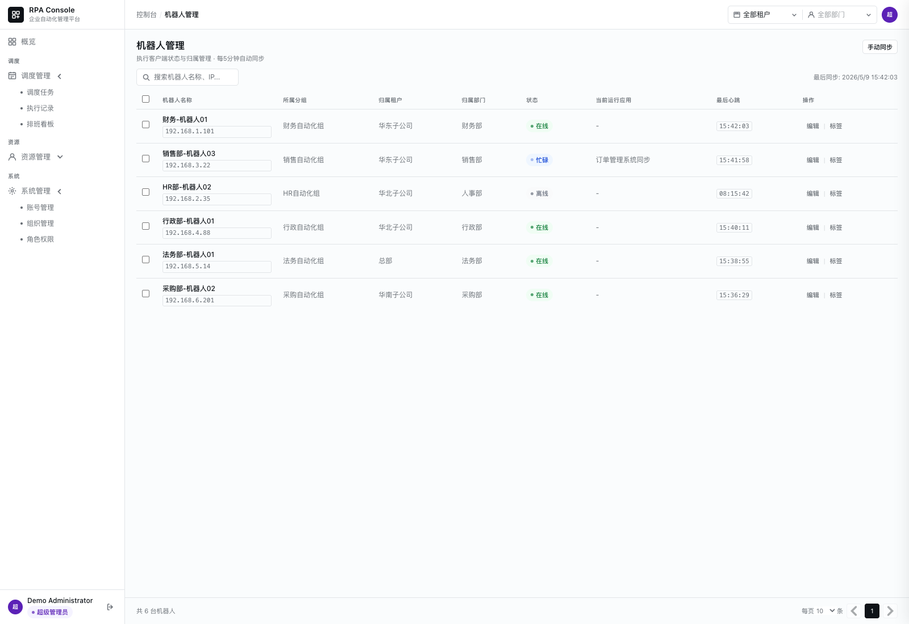

# yingdao-rpa-console

> 一个面向企业自动化运营场景的 RPA 管理控制台前端开源版。

`yingdao-rpa-console` 是一个基于 Vue 3 + TypeScript 构建的企业级 RPA 控制台前端项目，围绕“自动化资源运营管理”展开，覆盖组织视角、应用视角、机器人视角、调度任务视角和执行记录视角，适合用于企业内部自动化平台、自定义 RPA 门户或调度运营后台。

本仓库**仅开源前端代码与演示能力**。  
后端服务、调度执行逻辑、数据库实现、影刀 OpenAPI 接入实现等内容**不包含在公开仓库中**。

## 项目状态

- 当前阶段：`Preview / Frontend Open Source Edition`
- 开源重点：前端产品实现、后台交互设计、Mock 演示能力
- 适合人群：希望快速搭建 RPA 管理后台、自动化运营中台、机器人调度前端的开发者或团队

## 为什么值得看

- 这不是一个单纯的“管理后台壳子”，而是围绕 RPA 资源运营场景组织过的信息架构
- 仓库内保留了完整的 Mock 演示能力，没有后端也能直接体验主要页面和交互流程
- 项目把组织、账号、应用、机器人、任务、执行记录、排班看板放进同一套控制台视图，适合作为二次开发模板
- UI 设计稿和接口契约一并保留，便于你基于自己的后端进行快速接入

## 项目特性

- 多租户 / 多部门的组织管理界面
- 账号、应用、机器人、标签的统一管理体验
- 调度任务创建向导与执行记录闭环
- 机器人时间轴排班看板
- 支持无后端依赖的 Mock 演示模式
- 适合作为企业自动化中台前端模板继续扩展

## 核心模块

| 模块 | 说明 |
| --- | --- |
| Dashboard | 统计指标、执行趋势、标签分布、应用排行、机器人利用率 |
| 组织管理 | 租户、部门、可见范围切换、多租户信息组织 |
| 账号管理 | 账号列表、角色分配、租户归属、部门归属 |
| 应用管理 | RPA 应用查询、详情查看、租户映射 |
| 机器人管理 | 机器人状态、分组、归属调整、运行信息查看 |
| 标签管理 | 标签维护、资源打标、批量标签操作 |
| 调度任务 | 任务列表、启停、触发、编辑、创建向导 |
| 执行记录 | 执行明细、状态追踪、异常排查入口 |
| 排班看板 | 机器人时间轴与任务占用视图 |

## 功能截图

### 登录页


### 概览页


### 组织管理


### 账号管理


### 应用管理


### 标签管理


### 调度任务


### 执行记录


### 排班看板


### 机器人管理


## 开源范围说明

公开仓库包含：

- `frontend/rpa-console-ui`：前端项目源码
- `docs/prd/`：产品需求说明
- `docs/tech-solution/`：脱敏后的技术方案、编码规范、接口契约
- `docs/test-cases/`：脱敏后的测试用例
- `docs/ui/`：UI 设计参考
- README、License、Issue 模板、PR 模板等社区文件

公开仓库不包含：

- Spring Boot 后端实现
- 调度执行服务与数据库实现
- 影刀 API 密钥、回调密钥、JWT 密钥、数据库配置
- 内部测试结果、反馈文档、执行计划、协作规范文档

## 技术栈

- Vue 3
- TypeScript
- Vite
- Pinia
- Vue Router
- Axios

## 目录结构

```text
.
├── frontend/rpa-console-ui/      # 前端项目
├── backend/README.md             # 后端未开源说明
├── docs/
│   ├── prd/
│   │   └── RPA-Console-PRD.md    # 产品需求说明
│   ├── tech-solution/
│   │   ├── api-contract.yaml     # 对外保留的接口契约
│   │   ├── architecture.md       # 脱敏后的技术方案
│   │   └── coding-standards.md   # 编码规范
│   ├── test-cases/
│   │   └── test-cases.md         # 脱敏后的测试用例
│   └── ui/
│       ├── login.html            # 登录页设计稿
│       └── rpa-console-v3.html   # 主应用设计稿
├── assets/screens/               # README 截图资源
└── .github/                      # Issue / PR 模板
```

## 快速开始

### 1. 环境要求

- Node.js 20+
- npm 10+

### 2. 启动 Mock 演示模式

```bash
cd frontend/rpa-console-ui
cp .env.example .env.local
npm install
npm run dev
```

启动后打开终端中输出的本地地址即可。

`.env.example` 默认启用了 Mock 模式，所以即使没有后端，也可以直接体验完整界面流程。

### 3. 演示登录方式

在 Mock 模式下：

- 任意非空账号可登录
- 任意非空密码可登录
- SSO 登录按钮为演示模拟，不会跳转真实认证系统

推荐演示账号：

```text
admin@example.com
```

### 4. 推荐体验路径

首次打开后，建议按这个顺序体验：

1. `Dashboard`：先看整体指标和趋势卡片
2. `组织管理 / 账号管理`：理解多租户和账号归属结构
3. `应用 / 机器人 / 标签`：查看资源运营管理视角
4. `调度任务 / 执行记录`：体验任务闭环
5. `排班看板`：查看机器人时间轴排班展示

## 环境变量

### Mock 模式

```env
VITE_ENABLE_MOCK=true
```

用于纯前端演示，不依赖任何后端服务。

### 对接真实后端模式

```env
VITE_ENABLE_MOCK=false
VITE_API_BASE_URL=http://localhost:8080
```

仅当你具备兼容接口的后端实现时再关闭 Mock 模式。

## 接口契约

公开仓保留了接口契约，便于你基于自己的后端进行对接：

- [docs/tech-solution/api-contract.yaml](./docs/tech-solution/api-contract.yaml)

注意：公开版契约已做脱敏处理，不包含任何内部密钥、测试口令或生产部署信息。

## 公开文档

除了前端源码，公开仓还保留了几类便于二次开发的文档：

- PRD：帮助你理解业务目标和功能边界
- 技术方案：帮助你理解模块划分、数据模型和后端接口意图
- 测试用例：帮助你对齐主要业务行为和接口预期
- UI 设计稿：帮助你还原页面布局和交互结构

这些文档均会在导出时做脱敏处理，不包含私有后端源码和内部密钥。

如果你计划接入真实后端，建议先完成以下检查：

- 你的后端接口路径与字段结构能够对齐 `api-contract.yaml`
- 你的认证方式能兼容前端登录态与用户信息获取流程
- 你已经准备好组织、账号、应用、机器人、调度任务、执行记录等基础数据
- 你不依赖公开仓中不存在的私有调度执行实现

## 适用场景

适合用于：

- 企业内部 RPA 管理后台
- 自动化资源运营中台
- 机器人调度可视化前端
- 基于影刀 RPA 进行二次封装的控制台产品

不适合直接用于：

- 无后端改造的一键生产部署
- 通用工作流引擎后端替代品
- 完整的开箱即用 SaaS 平台

## 开发说明

- 公开仓重点在于前端产品实现和交互设计
- 为了方便体验，仓库内集成了完整 Mock 请求能力
- 私有后端实现不会在本仓库中公开

## 已知限制

- 本仓库**不是完整的开箱即用 SaaS 产品**
- 公开版不包含后端源码、数据库设计实现、调度执行引擎和影刀 OpenAPI 接入代码
- Mock 模式主要用于页面体验和交互演示，不等价于真实生产数据流
- SSO 入口为演示用途，不连接真实认证中心
- 若要投入真实业务场景，需要你自行实现后端、鉴权、存储和调度执行能力

## Roadmap

- 持续完善 Mock 数据与演示路径
- 补充更多页面截图和示例数据场景
- 增加更多公开版示例页面与空状态设计
- 增加 Docker 化前端演示启动方式
- 补充英文版 README
- 将部分通用管理组件抽离为可复用模块

## 参与贡献

欢迎围绕以下方向提交 Issue 或 PR：

- 前端体验优化
- 交互设计改进
- 响应式与可访问性优化
- Mock 数据和演示流程完善
- 文档与开发体验改进

贡献前请先阅读：

- [CONTRIBUTING.md](./CONTRIBUTING.md)
- [CODE_OF_CONDUCT.md](./CODE_OF_CONDUCT.md)
- [SECURITY.md](./SECURITY.md)

## 联系我

如果你希望交流项目实现、RPA 场景落地、前端二次开发或合作事宜，可以通过微信联系我：

- 微信名：`新页`
- 所在地：`浙江 杭州`

如果后续仓库中补充了微信名片图片，我会继续将二维码素材同步到公开仓。

## License

本项目采用 [MIT License](./LICENSE) 开源。

## 免责声明

本项目是一个基于企业自动化管理场景构建的独立前端开源项目，**不是影刀官方仓库**。  
如需完整可运行方案，请基于你自己的后端实现或私有部署能力进行对接。
